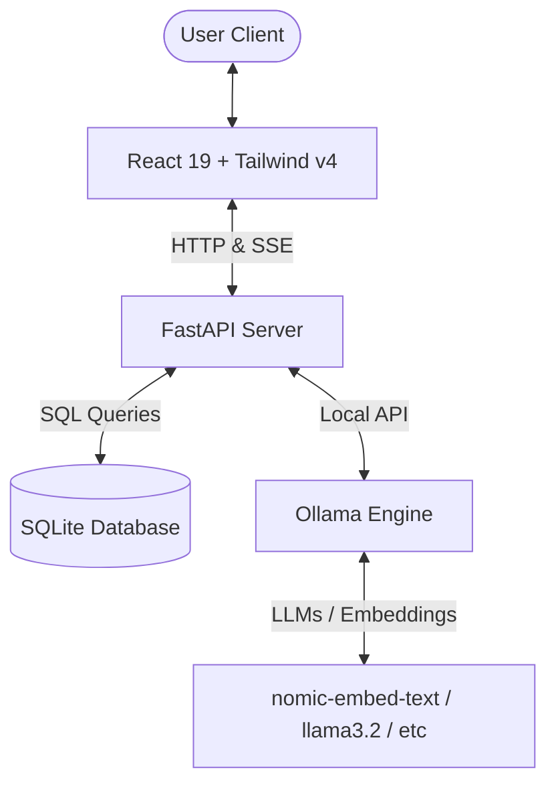

# 🧠 Offline Local LLM Application with RAG

A premium, fully offline, privacy-first chatbot application that lets you chat with local Large Language Models (LLMs) and perform Retrieval-Augmented Generation (RAG) over your PDF and text documents. 

Built using a **FastAPI** backend, a **React 19 + Tailwind CSS v4** frontend, and powered entirely by **Ollama** running locally on your machine.

---

## 🚀 Key Features

*   **100% Offline & Private:** No API keys, no subscription fees, and no third-party data tracking. All models and data remain local.
*   **Dynamic Local LLM Selection:** Automatically fetches and allows switching between any models currently installed on your local Ollama setup (e.g., `llama3.2`, `mistral`, `gemma2`).
*   **Retrieval-Augmented Generation (RAG):**
    *   **Document Ingestion:** Upload `.pdf`, `.txt`, or `.md` files.
    *   **Local Chunking & Embeddings:** Documents are automatically chunked and embedded locally using `nomic-embed-text`.
    *   **In-Memory SQLite Vector Search:** Computes cosine similarity (dot product of normalized vectors) directly in SQLite/Python to inject relevant context.
*   **Real-time Streaming Responses:** Uses Server-Sent Events (SSE) to stream model responses token-by-token.
*   **Threaded Chat Sessions:** Save and manage multiple chat histories, persist conversation logs, and delete threads.
*   **Customizable System Prompts:** Fine-tune model behavior directly from the user interface.

---

## 🏗️ Architecture Overview



### Data Layer
The database is structured locally inside a SQLite file: `local_llm.db`. It contains three tables:
1.  `sessions`: Tracks chat thread titles and timestamps.
2.  `messages`: Persists chat logs (role and text content).
3.  `document_chunks`: Stores text segments, document sources, and raw vector embedding JSON arrays for semantic similarity matching.

---

## 🛠️ Prerequisites

1.  **Node.js & pnpm:** To run the React client.
2.  **Python 3.10+:** To run the FastAPI server.
3.  **Ollama:** Make sure Ollama is installed and running on your system.
    *   [Download Ollama](https://ollama.com/)
    *   Pull an LLM (e.g., `llama3.2`):
        ```bash
        ollama pull llama3.2
        ```
    *   Pull the embedding model (required for RAG):
        ```bash
        ollama pull nomic-embed-text
        ```

---

## ⚙️ Quick Start

Follow these steps to run both services simultaneously.

### 1. Backend Setup
1.  Navigate to the `backend` directory:
    ```bash
    cd backend
    ```
2.  Create and activate a virtual environment:
    ```bash
    python -m venv venv
    source venv/bin/activate  # On Windows: venv\Scripts\activate
    ```
3.  Install dependencies:
    ```bash
    pip install -r requirements.txt
    ```
4.  Start the FastAPI development server:
    ```bash
    uvicorn app.main:app --reload
    ```
    The backend will run on [http://localhost:8000](http://localhost:8000).

### 2. Frontend Setup
1.  Navigate to the `frontend` directory:
    ```bash
    cd frontend
    ```
2.  Install dependencies:
    ```bash
    pnpm install
    ```
3.  Start the Vite dev server:
    ```bash
    pnpm dev
    ```
    The frontend will run on [http://localhost:5173](http://localhost:5173).

---

## 🗺️ File Structure & Code Tour

*   **[`backend/app/main.py`](file:///Users/mini_juanjo/Development/AI%20Engineering%20Proyects/Offline-Local-LLM-Application/backend/app/main.py):** Main API routes for model detection, sessions, documents, and real-time SSE streaming chat with RAG.
*   **[`backend/app/services.py`](file:///Users/mini_juanjo/Development/AI%20Engineering%20Proyects/Offline-Local-LLM-Application/backend/app/services.py):** Encapsulates integrations with Ollama (embeddings & streaming chat) and handles PDF text extraction and sliding window text chunking.
*   **[`backend/app/database.py`](file:///Users/mini_juanjo/Development/AI%20Engineering%20Proyects/Offline-Local-LLM-Application/backend/database.py):** Schema definitions and SQLite initializations.
*   **[`frontend/src/App.jsx`](file:///Users/mini_juanjo/Development/AI%20Engineering%20Proyects/Offline-Local-LLM-Application/frontend/src/App.jsx):** Main React component managing the workspace UI, streaming inputs, document attachments, and dark mode controls.
*   **[`frontend/src/index.css`](file:///Users/mini_juanjo/Development/AI%20Engineering%20Proyects/Offline-Local-LLM-Application/frontend/src/index.css):** Custom styling setup using Tailwind CSS v4.

---

## 📡 API Reference

| Endpoint | Method | Description |
| :--- | :--- | :--- |
| `/api/models` | `GET` | Fetches local models downloaded on Ollama. |
| `/api/sessions` | `GET` / `POST` | Lists all chat sessions or creates a new thread. |
| `/api/sessions/{id}` | `DELETE` | Deletes a session and cascades deletes messages/documents. |
| `/api/sessions/{id}/messages` | `GET` | Retrieves full message history for a session. |
| `/api/sessions/{id}/documents` | `GET` / `POST` | Lists uploaded documents or uploads a new document for chunking & embedding. |
| `/api/chat/stream` | `POST` | Streams response tokens with SSE and performs local similarity search. |

---

## 🛡️ License

This project is open-source and available under the [MIT License](LICENSE).
